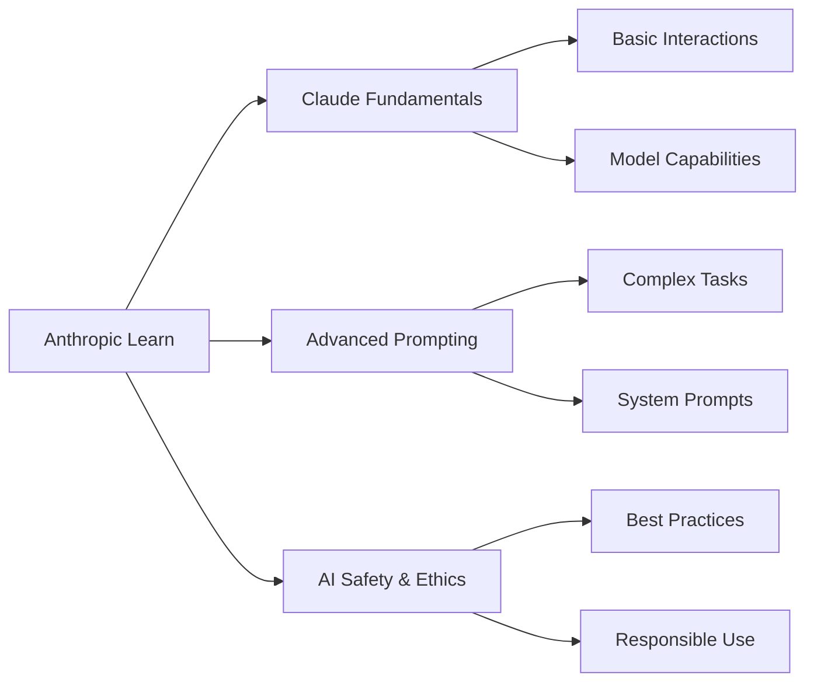

# 🎓 Anthropic Learn Completion Certificates

<div align="center">
  
  
  
  
  
  <br/>
  
  ### 🚀 **AI Education Journey with Claude**
  
  <p align="center">
    <em>Mastering the art of AI interaction through Anthropic's comprehensive learning platform</em>
  </p>
  
  ---
  
</div>

## 📚 About This Repository

This repository contains my completion certificates from [**Anthropic Learn**](https://www.anthropic.com/learn), demonstrating proficiency in working with Claude and understanding AI capabilities, safety, and best practices.

<br/>

## 🏆 Achievements

<table>
  <tr>
    <td align="center" width="33%">
      <h3>🎯 Certificate 1</h3>
      <code>certificate-kqqcgey97h82</code>
      <br/><br/>
      
    </td>
    <td align="center" width="33%">
      <h3>🎯 Certificate 2</h3>
      <code>certificate-dzijwz7xuk34</code>
      <br/><br/>
      
    </td>
    <td align="center" width="33%">
      <h3>🎯 Certificate 3</h3>
      <code>certificate-7ehubcqn26xs</code>
      <br/><br/>
      
    </td>
  </tr>
</table>

<br/>

## 🌟 Key Learning Areas

<div align="center">
  
| 🤖 **AI Fundamentals** | 🛡️ **AI Safety** | 💡 **Prompt Engineering** |
|:---:|:---:|:---:|
| Understanding Claude's capabilities | Responsible AI usage | Crafting effective prompts |
| Token optimization | Constitutional AI principles | Context window management |
| Model limitations | Harm prevention | Chain-of-thought reasoning |

</div>

<br/>

## 📊 Skills Acquired



<br/>

## 🔗 Verification

All certificates in this repository are official completions from:
- **Platform**: [Anthropic Learn](https://www.anthropic.com/learn)
- **Provider**: Anthropic
- **Model**: Claude AI Assistant

<br/>

## 📈 Learning Path Progress

```
[████████████████████] 100% Complete
```

- ✅ **Introduction to Claude**
- ✅ **Advanced Prompt Engineering**
- ✅ **AI Safety and Best Practices**

<br/>

## 💼 Professional Development

These certifications demonstrate:
- 🎯 Commitment to understanding AI technology
- 🚀 Practical skills in AI interaction
- 🛡️ Knowledge of responsible AI deployment
- 💡 Expertise in prompt engineering techniques

<br/>

## 🌐 Connect

<div align="center">
  
[](https://github.com/developtheweb)
[](mailto:developtheweb@protonmail.com)

</div>

<br/>

---

<div align="center">
  <sub>📅 Last Updated: August 2024</sub>
  <br/>
  <sub>Made with 🤖 and continuous learning</sub>
</div>