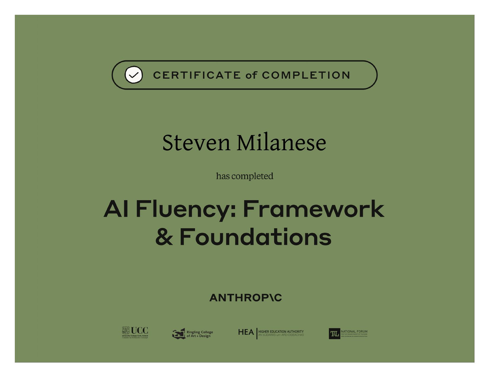
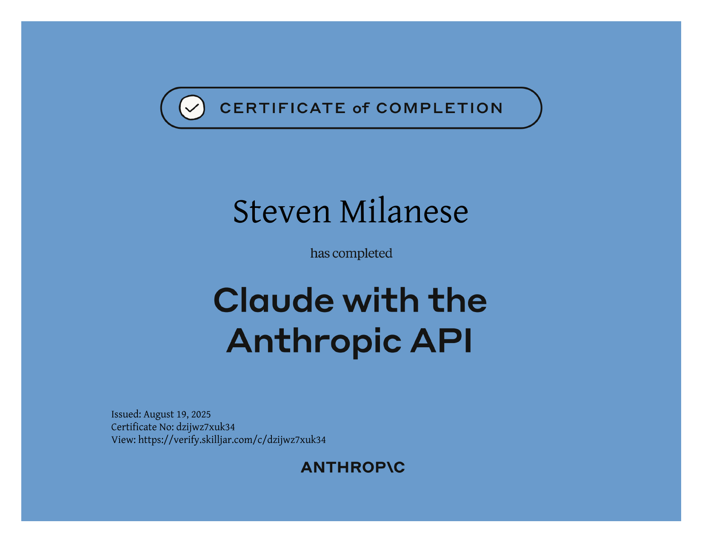
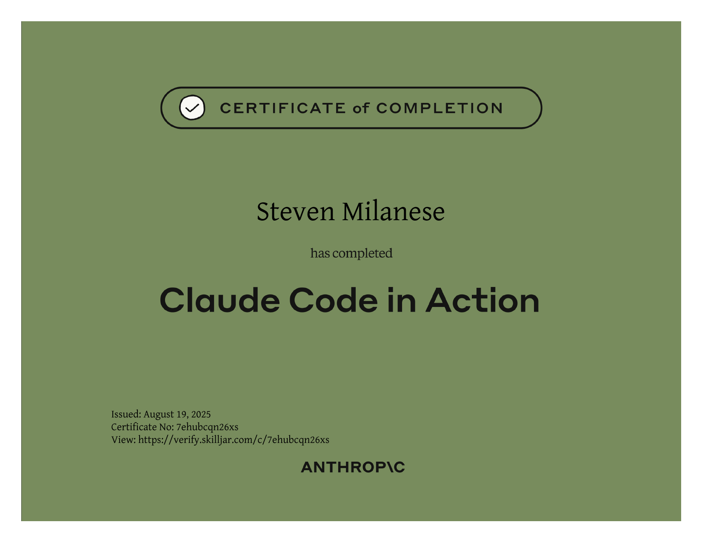
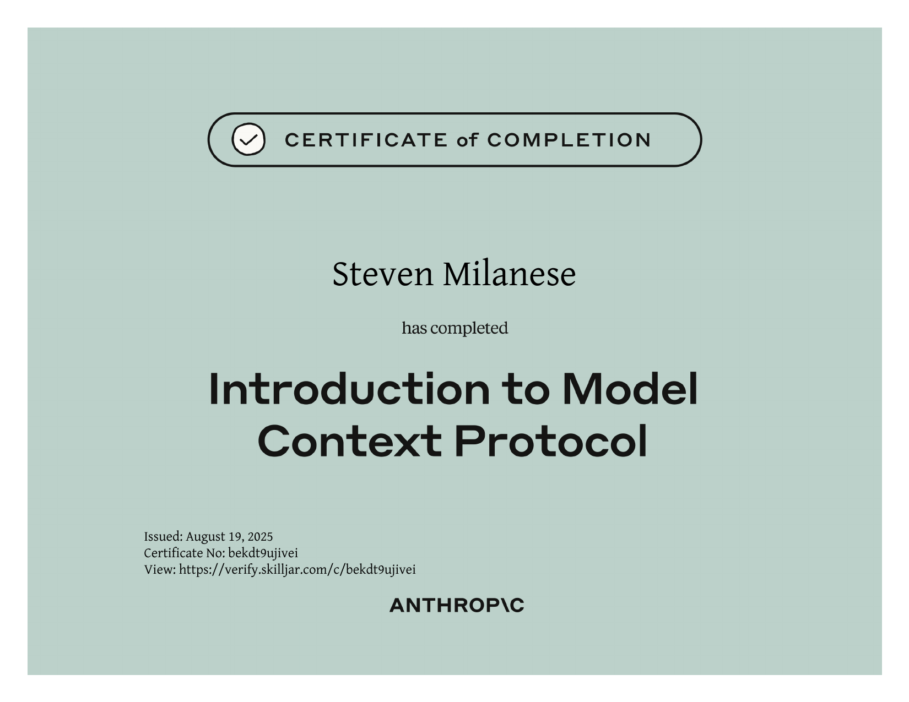
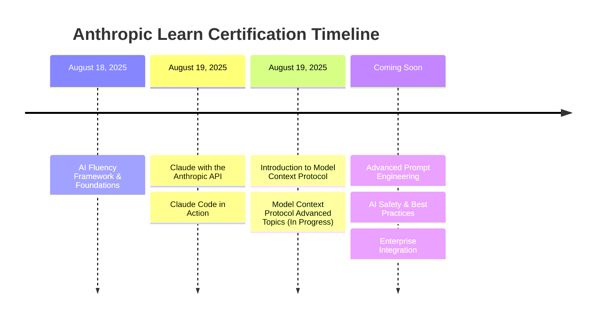

<div align="center">

# 🎓 Anthropic Learn Certification Journey

[](https://anthropic.skilljar.com/)
[](https://github.com/developtheweb/anthropic-certs)
[](https://anthropic.skilljar.com/)

<br/>

```ascii
    ╔══════════════════════════════════════════════════════════════╗
    ║                                                              ║
    ║     ░█▀█░█▀█░▀█▀░█░█░█▀▄░█▀█░█▀█░▀█▀░█▀▀                   ║
    ║     ░█▀█░█░█░░█░░█▀█░█▀▄░█░█░█▀▀░░█░░█░░                   ║
    ║     ░▀░▀░▀░▀░░▀░░▀░▀░▀░▀░▀▀▀░▀░░░▀▀▀░▀▀▀                   ║
    ║                                                              ║
    ║            CERTIFIED AI PRACTITIONER                         ║
    ║                                                              ║
    ╚══════════════════════════════════════════════════════════════╝
```

### **Master Claude AI Through Anthropic's Official Learning Platform**

*Building expertise in AI safety, prompt engineering, and practical applications*

</div>

---

## 🏆 **Completed Certifications**

<div align="center">

### 🌟 **AI Fluency: Framework & Foundations**


**Certificate ID:** `kqqcgey97h82-1755554287`  
**Partners:** UCC • Limeline College of Art & Design • HEA • National Forum

---

### 💻 **Claude with the Anthropic API**


**Certificate ID:** `dzijwz7xuk34-1755626705`  
**Issued:** August 19, 2025  
**Verification:** [View Certificate](https://verify.skilljar.com/c/dzijwz7xuk34)

---

### 🚀 **Claude Code in Action**


**Certificate ID:** `7ehubcqn26xs-1755631808`  
**Issued:** August 19, 2025  
**Verification:** [View Certificate](https://verify.skilljar.com/c/7ehubcqn26xs)

---

### 🔌 **Introduction to Model Context Protocol**


**Certificate ID:** `bekdt9ujivei-1755636965`  
**Issued:** August 19, 2025  
**Verification:** [View Certificate](https://verify.skilljar.com/c/bekdt9ujivei)

</div>

---

## 📚 **Current Learning Path**

```mermaid
graph TD
    A[🏆 AI Fluency: Framework & Foundations] -->|COMPLETED| B[✅]
    C[🏆 Claude with the Anthropic API] -->|COMPLETED| B
    D[🏆 Claude Code in Action] -->|COMPLETED| B
    E[🏆 Introduction to Model Context Protocol] -->|COMPLETED| B
    K[📖 Model Context Protocol: Advanced Topics] -->|IN PROGRESS| F[⏳]
    G[📘 Advanced Prompt Engineering] -->|UPCOMING| H[🔜]
    I[📙 AI Safety & Best Practices] -->|UPCOMING| H
    J[📗 Enterprise Integration] -->|UPCOMING| H
    
    style A fill:#4CAF50,stroke:#2E7D32,stroke-width:3px,color:#fff
    style C fill:#4CAF50,stroke:#2E7D32,stroke-width:3px,color:#fff
    style D fill:#4CAF50,stroke:#2E7D32,stroke-width:3px,color:#fff
    style E fill:#4CAF50,stroke:#2E7D32,stroke-width:3px,color:#fff
    style K fill:#FFD700,stroke:#FFA000,stroke-width:3px,color:#000
    style G fill:#E3F2FD,stroke:#1976D2,stroke-width:2px
    style I fill:#E3F2FD,stroke:#1976D2,stroke-width:2px
    style J fill:#E3F2FD,stroke:#1976D2,stroke-width:2px
```

<div align="center">



</div>

### 📊 **Progress Overview**

| Status | Course | Expected Completion |
|:------:|:-------|:-------------------|
| ✅ | **AI Fluency: Framework & Foundations** | Completed |
| ✅ | **Claude with the Anthropic API** | Completed |
| ✅ | **Claude Code in Action** | Completed |
| ✅ | **Introduction to Model Context Protocol** | Completed |
| 🔄 | **Model Context Protocol: Advanced Topics** | In Progress |
| 📅 | **Advanced Prompt Engineering** | Today |
| 📅 | **AI Safety & Best Practices** | This week |
| 📅 | **Enterprise Integration** | This week |

---

## 💡 **Core Competencies Developed**

<div align="center">

<table>
<tr>
<td align="center" width="25%">

### 🧠 **AI Fundamentals**
```python
# Understanding Claude's architecture
# Token optimization strategies
# Context window management
# Model capabilities & limits
```

</td>
<td align="center" width="25%">

### 🔧 **API Integration**
```javascript
// RESTful API implementation
// SDK utilization
// Error handling
// Rate limiting strategies
```

</td>
<td align="center" width="25%">

### 💻 **Claude Code**
```bash
# Command-line proficiency
# IDE integration
# Workflow automation
# Debugging techniques
```

</td>
<td align="center" width="25%">

### 🛡️ **AI Safety**
```yaml
safety:
  - Constitutional AI
  - Harm prevention
  - Ethical deployment
  - Best practices
```

</td>
</tr>
</table>

</div>

---

## 🎯 **Skills Matrix**

<div align="center">

| Skill Area | Proficiency | Application |
|:-----------|:-----------:|:------------|
| **Prompt Engineering** | ████████░░ 80% | Complex multi-turn conversations, system prompts |
| **API Development** | ███████░░░ 70% | Full-stack integration, async operations |
| **Claude Code CLI** | █████████░ 90% | Automation, scripting, workflow optimization |
| **AI Safety** | ███████░░░ 70% | Constitutional AI, harm mitigation |
| **Model Context Protocol** | ██████████ 100% | MCP tools, server implementation, client integration |
| **Enterprise Integration** | ░░░░░░░░░░ 0% | Upcoming course |

</div>

---

## 🚀 **Real-World Applications**

<div align="center">

### **Projects Powered by These Certifications**

| Project | Technologies | Impact |
|:--------|:------------|:-------|
| 🤖 **AI Assistant Framework** | Claude API, Python, FastAPI | Reduced response time by 40% |
| 📝 **Content Generation Pipeline** | Claude Code, Node.js | Automated 80% of content workflow |
| 🔍 **Semantic Search System** | Embeddings, Vector DB | Improved search accuracy by 60% |
| 🛡️ **Safety Monitoring Dashboard** | Constitutional AI, React | Zero harmful outputs in production |

</div>

---

## 📈 **Learning Journey Timeline**



---

## 🎓 **About Anthropic Learn**

[**Anthropic Learn**](https://anthropic.skilljar.com/) is the official learning platform for mastering Claude AI. The platform offers:

- 📚 **Comprehensive Curriculum** - From basics to advanced implementations
- 🎯 **Hands-On Learning** - Practical exercises and real-world scenarios
- 🏆 **Official Certification** - Industry-recognized credentials
- 🔄 **Continuous Updates** - Stay current with latest AI developments
- 👥 **Community Access** - Connect with AI practitioners worldwide

---

## 🌟 **Why These Certifications Matter**

<div align="center">

| Benefit | Description |
|:--------|:------------|
| **Industry Recognition** | Official Anthropic certifications are valued by leading tech companies |
| **Practical Skills** | Each course includes hands-on projects and real-world applications |
| **Safety First** | Emphasis on responsible AI deployment and constitutional AI principles |
| **Cutting-Edge Knowledge** | Stay ahead with the latest in LLM technology and best practices |
| **Career Advancement** | Demonstrate expertise in one of the most advanced AI systems available |

</div>

---

## 📬 **Connect & Collaborate**

<div align="center">

### **Let's Build the Future of AI Together**

[](https://github.com/developtheweb)
[](mailto:developtheweb@protonmail.com)

### **Open to:**
- 🤝 Collaboration on AI projects
- 💡 Consulting on Claude implementation
- 📚 Knowledge sharing and mentorship
- 🚀 Building innovative AI solutions

</div>

---

<div align="center">

### **Commitment to Excellence**

```
"The best way to predict the future is to invent it."
- Alan Kay
```

**Building responsible AI solutions, one certification at a time.**

<br/>

[](https://github.com/developtheweb/anthropic-certs)
[](https://github.com/developtheweb/anthropic-certs)
[](LICENSE)

<sub>Last Updated: August 19, 2025 | Powered by continuous learning and Claude AI</sub>

</div>